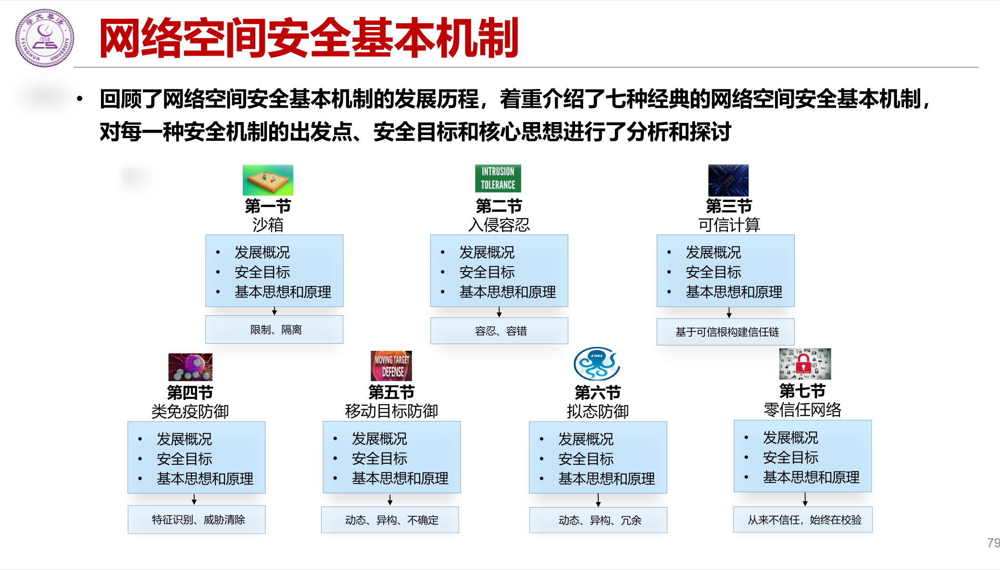

# 沙箱
沙箱（Sandbox）是一种安全机制，用于隔离和限制应用程序或进程的运行环境，以防止其对系统或其他应用程序造成潜在的危害。它创建了一个受控的执行环境，使应用程序在该环境中运行，而不会对主机系统或其他应用程序产生不良影响。

沙箱的主要目标是提供一种安全隔离层，以防止恶意应用程序或恶意代码对系统造成损害。它可以限制应用程序的访问权限和资源使用，防止其对敏感数据、文件系统、网络和系统配置等进行未经授权的访问或更改。

沙箱通常使用以下技术和机制来实现安全隔离：

1. 进程隔离：沙箱将应用程序置于独立的进程中，使其与其他进程相互隔离，防止恶意应用程序通过共享内存或进程间通信等方式进行干扰或攻击。

2. 资源限制：沙箱可以限制应用程序对系统资源（如内存、CPU、磁盘空间）的访问和使用，以防止其过度占用资源或影响其他应用程序的正常运行。

3. 文件系统隔离：沙箱可以为应用程序提供一个独立的文件系统视图，使其无法访问主机系统上的其他文件或目录，从而保护系统的敏感数据和文件。

4. 网络隔离：沙箱可以限制应用程序的网络访问权限，阻止其与外部网络进行直接通信或限制其访问特定的网络资源。

5. 行为监控：沙箱可以监控应用程序的行为，检测和阻止其执行恶意活动或违规操作，例如访问未经授权的API、修改系统设置或执行潜在危险的操作。

沙箱广泛应用于计算机安全领域，包括操作系统、浏览器、应用程序安全和恶意软件分析等。它提供了一种强大的安全机制，可以有效地隔离和保护系统免受恶意代码或恶意行为的影响。

